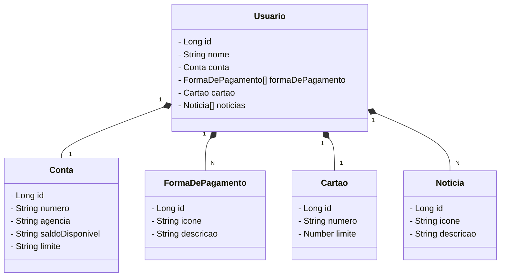

# Santander Dev Week 2024
Java RESTful API criada para o Santander Dev Week 2024

## Diagrama de Classes

```mermaid
classDiagram
    class Usuario {
        - Long id
        - String nome
        - Conta conta
        - FormaDePagamento[] formaDePagamento
        - Cartao cartao
        - Noticia[] noticias
    }

    class Conta {
        - Long id
        - String numero
        - String agencia
        - String saldoDisponivel
        - String limite
    }

    class FormaDePagamento {
        - Long id
        - String icone
        - String descricao
    }

    class Cartao {
        - Long id
        - String numero
        - Number limite
    }

    class Noticia {
        - Long id
        - String icone
        - String descricao
    }

    Usuario "1" *-- "1" Conta
    Usuario "1" *-- "N" FormaDePagamento
    Usuario "1" *-- "1" Cartao
    Usuario "1" *-- "N" Noticia
```
